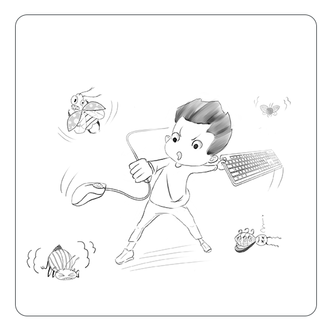
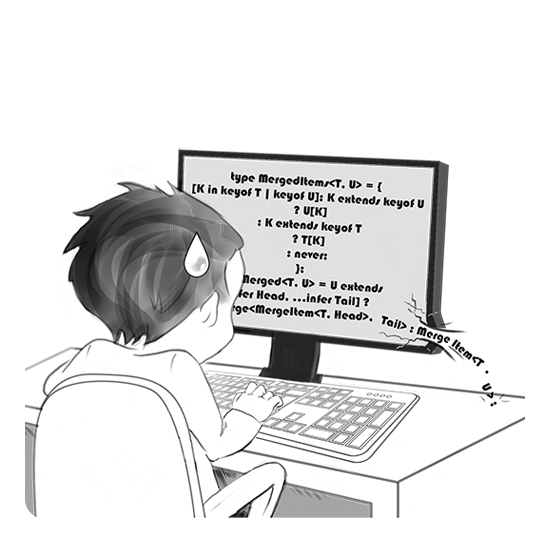
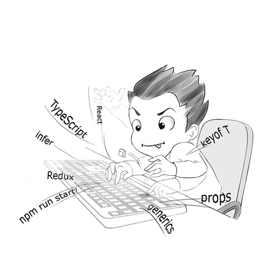

  <a href="https://git.io/typing-svg">_<);A+lot+of+code.;And+it's+great!+%5Co%2F" alt="Typing SVG"/></a>

  
  &nbsp;&nbsp;&nbsp;
  
  &nbsp;&nbsp;&nbsp;
  

# About me

<pre><code>let me: PersonDetails = {
  name: {
    first: 'Кирилл',
    surname: 'Петров',
    pronounce: 'Kirill Petrov'
  },
  education: {
    university: 'Ryazan State Radio Engineering University named after V. F. Utkin'
    level: '<a href="https://en.wikipedia.org/wiki/International_Standard_Classification_of_Education">ISCED 6</a>'
  },
  job: [{
    position: 'Senior front-end developer',
    role: 'Teamlead',
    from: new Date('2020-05-20T00:00:00Z'),
    details: '<a href="#backoffice-for-the-print-subscription-service">#job-it1</a>'
  }, {
    position: 'Software developer',
    role: 'Fullstack developer',
    from: new Date('2009-12-05T00:00:00Z'),
    to: new Date('2020-05-10T00:00:00Z'),
    details: '<a href="#legal-reference-system-garant">#job-garant</a>'
  }],
  petProjects: [{
    name: 'Eve Fleet Manager',
    description: 'Set of tools for Eve Online video game: analysis, statistics, helpers.'
    details: '<a href="#eve-fleet-manager">#pet-efm</a>'
  }],
  goals: [{
    type: 'optional',
    name: 'Rewrite pet project using new stack.'
  }],
}</code></pre>

# Projects

## Legal reference system "Garant"
The application provides an opportunity to get up-to-date information about the articles of laws, see specific changes, compare versions of documents, and access older versions.

The development of the project began in 2012. The goal was to develop a SPA that would fully replicate the functionality of the desktop application. It was an ambitious goal - in those days there were no such rich tools as there are now, and we had to deal with finicky browsers. I designed the architecture of the application and wrote the base components of the system. After that the team was expanded by two developers, together with whom we started to add business functions.

At the time I left the company, the application had more than 50 screens, 700+ classes and components, and was about 2 Mb of JavaScript code. It was an extremely interesting project and I was happy to hear that the company was going to rewrite the application using the latest stack. Even now it's going to be a fascinating piece of work.

### Stack & tech
Front end:
* **Sencha ExtJS 4**

Back end:
* **Python** on *facade-server* of application which interacts with data-server via CORBA interface
* **C++** on *data-server* for access to huge self-written database

### Gallery
||||
|:---:|:---:|:---:|
|<a href="images/projects/garant/main.png?raw=1"> Main page</a>|<a href="images/projects/garant/search.png?raw=1"> Search results</a>|<a href="images/projects/garant/document.png?raw=1"> Document</a>|
|<a href="images/projects/garant/document_toc.png?raw=1"> Document + TOC</a>|<a href="images/projects/garant/document_editions.png?raw=1"> Document + editions</a>|<a href="images/projects/garant/compare_editions.png?raw=1"> Compare of two editions</a>|

## Backoffice for the print subscription service
The project of subscription access to printed materials: magazines, newspapers, booklets, almanacs, etc. Thousands of publications, hundreds of publishers, delivery to millions of subscribers through the infrastructure of post offices.

For such a business to work, it is necessary to connect all the components and provide all the representatives with the opportunity to publish their materials conveniently, giving them the opportunity to subscribe to them. The project implemented tools for publishers and managers so that the former can submit a request to place material and the latter can process it. The system also allows managers to edit directories and dictionaries, work with mailing lists, generate reports, financial documents and much more.

The project was implemented as part of a microservice architecture of more than 30 services, and the data were aggregated on two sites - separately for publishers and for managers. In recent months, work has been underway to migrate the sites from the legacy stack to new technologies using [Feature-Sliced Design](https://feature-sliced.design/), React 17, TypeScript, code generation based on OpenAPI specifications, Gitlab CI/CD with deploying to Kubernetes, and so on.

### Stack & tech
Front end:
* **React 0.13**, **Angular 1**
* **React 17**, **Redux Toolkit**, **TypeScript 4.7**

Back end:
* **Java 8**
* **Java 17**, **Kotlin**

## Eve Fleet Manager
EFM is a pet project (in private repo) for universe of the [Eve Online](https://www.eveonline.com/) - #1 space MMORPG. The project specialized in providing analytical tools for players:
* Battle analysis with the ability to build a detailed statistical picture of the clash of thousands of players with automatic analysis of damage and distribution of players on the sides of the conflict. Thanks to the successful architecture, these calculations were extremely fast, even on large amounts of data, on the order of 0.15-0.4 seconds. In gallery below you may see an example of a clash of 2300 players who lost 2600 ships.
* Campaign analysis - a higher point of view on mass clashes of players in hundreds solar systems during weeks and months (up to year) and ability to analyze the degree of involvement and losses at the level of alliances and coalitions. The result is a picture with hundreds of thousands of ships lost. In gallery below you may see an example of campaign which describes 5 month war between several coalitions with 154000 in total number of pilots, who lost ~414000 ships which equal ~232000 USD.
* Fleet Assistant - thanks to [Meteor](https://www.meteor.com/)'s feature of reactive updating on the client of the data being changed in MongoDB, a tool was implemented to display the full fleet composition in the web application. Any change in fleet in the game was almost instantly reflected in the application, which allowed to operate the fleet giving opportunities that have not been implemented in the game so far. Additional functionality in the form of statistics on losses (total number of losses, rate of loss, etc.) and damage caused by the fleet allowed the commander to make strategic decisions.
* Other little tools like board of two types timers, wormhole map, etc

### Stack & tech
Frontend:
* **Meteor 1.10**, **SCSS**, **[Materialize](https://materializecss.com/)**

Back end:
* **Meteor**, **WebSocket**, **[ESI API](https://esi.evetech.net/ui/)**
* **MongoDB 4.0**

### Gallery
||||
|:---:|:---:|:---:|
|<a href="images/projects/efm/main.png?raw=1"> Main page (0.7 MB)</a>|<a href="images/projects/efm/battlereports.png?raw=1"> Most viewed battle reports (0.2 MB)</a>|<a href="images/projects/efm/battlereport_ships.png?raw=1"> Battle report: ships tab (4.8 MB)</a>|
|<a href="images/projects/efm/battlereport_timeline.png?raw=1"> Battle report: timeline tab (3.4 MB)</a>|<a href="images/projects/efm/battlereport_summary.png?raw=1"> Battle report: summary tab (1.2 MB)</a>|<a href="images/projects/efm/battlereport_organizations.png?raw=1"> Battle report: orgs tab (2.1 MB)</a>|
|<a href="images/projects/efm/battlereport_players.png?raw=1"> Battle report: players tab (2.7 MB)</a>|<a href="images/projects/efm/campaign_ships.png?raw=1"> Campaign: ships tab (2.1 MB)</a>|<a href="images/projects/efm/campaign_groups.png?raw=1"> Campaign: ship groups tab (0.7 MB)</a>|
|<a href="images/projects/efm/campaign_organizations.png?raw=1"> Campaign: orgs tab (0.4 MB)</a>|<a href="images/projects/efm/campaign_charts.png?raw=1"> Campaign: charts tab (0.7 MB)</a>|<a href="images/projects/efm/campaign_top_losses.png?raw=1"> Campaign: top losses tab (1.6 MB)</a>|

# Tech & skills

|      | Name | Seniority | Latest usage |
| :--- | ---  | ---       | ---          |
|  | HTML |  | now |
|  | CSS |  | now |
|  | JavaScript |  | now |
|  | TypeScript |  | now |
|  | React |  | now |
|  | Redux |  | now |
|  | Webpack |  | now |
|  | ESLint |  | now |
|  | Express |  | now |
|  | REST API |  | now |
|  | OpenAPI |  | now |
|  | Java |  | now |
|  | Microservices |  | now |
|  | Ubuntu Linux |  | now |
|  | Docker |  | now |
|  | Gitlab CI/CD |  | now |
|  | ExtJS (3, 4) |  | 3 years ago |
|  | Node.js |  | 2 years ago |
|  | Meteor |  | 2 years ago |
|  | Python |  | 3 years ago |
|  | MongoDB |  | 2 years ago |

# Statistics

